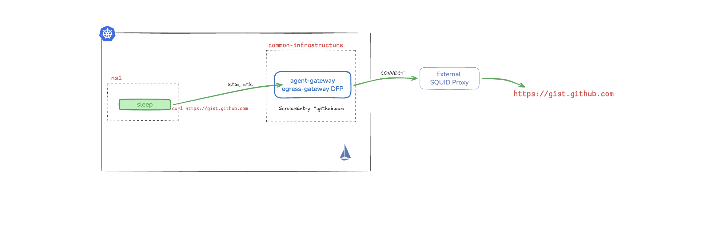

# agentgateway as an Istio Ambient Egress Gateway



This repository demonstrates how to run [Agentgateway](https://docs.solo.io/agentgateway/2.1.x/) as an egress gateway for Istio traffic, including external authentication with source identity and Dynamic Forward Proxy (DFP) with CONNECT to an external proxy.


The agentgateway is configured to operate as an **explicit forward proxy**, which is essential for compatibility with enterprise upstream proxies.


**HTTP (Port 80):** 
- Uses standard HTTP methods (GET, POST, etc.) - NOT CONNECT
- EnterpriseAgentgatewayPolicy enforces ext auth
- Squid proxy handles regular HTTP requests
- Result: HTTP traffic flows successfully through egress gateway → ext auth → squid → internet


**HTTPS (Port 443):**
- Uses CONNECT method to tunnel encrypted traffic
- Squid proxy establishes CONNECT tunnel for TLS
- Result: HTTPS traffic flows successfully through egress gateway → squid → internet
- Current Limitation: Ext Auth Policy

---

## Install Solo Enterprise for Istio

```bash
export GLOO_MESH_LICENSE_KEY=<license_key>
export AGENTGATEWAY_LICENSE_KEY=<license_key>

export ISTIO_VERSION=1.28.1-patch0
export ISTIO_IMAGE=${ISTIO_VERSION}-solo
export REPO=us-docker.pkg.dev/soloio-img/istio
export HELM_REPO=oci://us-docker.pkg.dev/soloio-img/istio-helm
```

CRDs:
```
helm upgrade --install istio-base ${HELM_REPO}/base \
--namespace istio-system \
--create-namespace \
--version ${ISTIO_IMAGE} \
-f - <<EOF
defaultRevision: ""
profile: ambient
EOF
```

Istiod:
```
helm upgrade --install istiod ${HELM_REPO}/istiod \
--namespace istio-system \
--version ${ISTIO_IMAGE} \
-f - <<EOF
env:
  # Assigns IP addresses to multicluster services
  PILOT_ENABLE_IP_AUTOALLOCATE: "true"
  # Disable selecting workload entries for local service routing.
  # Required for Gloo VirtualDestinaton functionality.
  # PILOT_ENABLE_K8S_SELECT_WORKLOAD_ENTRIES: "false"
  # Required when meshConfig.trustDomain is set
  PILOT_SKIP_VALIDATE_TRUST_DOMAIN: "true"
global:
  hub: ${REPO}
  network: cluster1
  proxy:
    clusterDomain: cluster.local
  tag: ${ISTIO_IMAGE}
istio_cni:
  namespace: istio-system
  enabled: true
meshConfig:
  accessLogFile: /dev/stdout
  defaultConfig:
    proxyMetadata:
      ISTIO_META_DNS_AUTO_ALLOCATE: "true"
      ISTIO_META_DNS_CAPTURE: "true"
# Required to enable multicluster support
platforms:
  peering:
    enabled: true
profile: ambient
license:
    value: ${GLOO_MESH_LICENSE_KEY}
EOF
```

CNI:
```
helm upgrade --install istio-cni ${HELM_REPO}/cni \
--namespace istio-system \
--version ${ISTIO_IMAGE} \
-f - <<EOF
# Assigns IP addresses to multicluster services
ambient:
  dnsCapture: true
excludeNamespaces:
  - istio-system
  - kube-system
global:
  hub: ${REPO}
  tag: ${ISTIO_IMAGE}
  variant: distroless
  # platform: gke # UNCOMMENT FOR GKE
profile: ambient
EOF
```

ztunnel:
```
helm upgrade --install ztunnel ${HELM_REPO}/ztunnel \
--namespace istio-system \
--version ${ISTIO_IMAGE} \
-f - <<EOF
configValidation: true
enabled: true
env:
  L7_ENABLED: "true"
  # Required when a unique trust domain is set for each cluster
  SKIP_VALIDATE_TRUST_DOMAIN: "true"
hub: ${REPO}
tag: ${ISTIO_IMAGE}
istioNamespace: istio-system
namespace: istio-system
network: cluster1
profile: ambient
proxy:
  clusterDomain: cluster.local
terminationGracePeriodSeconds: 29
variant: distroless
EOF
```

---

## Install Agentgateway

```bash
kubectl apply --server-side -f https://github.com/kubernetes-sigs/gateway-api/releases/download/v1.4.0/experimental-install.yaml

# Apply the new AgentgatewayPolicy CRD
kubectl apply -f agentgateway-policy-crd.yaml

helm upgrade -i --create-namespace \
--namespace agentgateway-system \
--version 2.1.0 enterprise-agentgateway-crds oci://us-docker.pkg.dev/solo-public/enterprise-agentgateway/charts/enterprise-agentgateway-crds

helm upgrade -i -n agentgateway-system enterprise-agentgateway oci://us-docker.pkg.dev/solo-public/enterprise-agentgateway/charts/enterprise-agentgateway \
--version 2.1.0 \
-f eagw-values.yaml \
--set-string licensing.licenseKey=${AGENTGATEWAY_LICENSE_KEY}
```


## Deploy Squid Proxy

This proxy can be external to the cluster but for the sake of this demo, we're going to deploy it in the cluster as a Deployment/Service. See squid-deployment.yml for details.

```bash
kubectl apply -f squid-deployment.yml
```

**Important Squid Configuration:**

The Squid proxy is configured to:
- Allow CONNECT method on port 443 for HTTPS tunneling
- Accept traffic on safe ports (80 for HTTP, 443 for HTTPS)
- Listen on port 3128 for proxy requests

This configuration is critical for HTTPS to work properly. Without `http_access allow CONNECT SSL_ports`, HTTPS requests will fail with TLS errors.

---

## agentgateway Egress Gateway

### Create Namespace for the Egress Gateway

```bash
kubectl create ns common-infrastructure
kubectl label ns common-infrastructure istio.io/use-waypoint=egress-gateway
```

### Deploy the Egress Gateway with Dynamic Forward Proxy

```bash
kubectl apply -f agentgateway.yml
```

#### ServiceEntry for static host: httpbingo.org

Create a ServiceEntry for `httpbingo.org` with both HTTP and HTTPS ports, and an AgentgatewayPolicy to configure the tunnel to Squid:

```bash
kubectl apply -f httpbin-se.yml
```

### ServiceEntry for wildcard hosts: *.github.com

Create a wildcard ServiceEntry for `*.github.com` with both HTTP and HTTPS ports, and an AgentgatewayPolicy to configure the tunnel to Squid:

```bash
kubectl apply -f github-wildcard-se.yml
```


## Deploy Sample Application in ns1 Namespace

```bash
kubectl create ns ns1
kubectl label ns ns1 istio.io/dataplane-mode=ambient
kubectl apply -f https://raw.githubusercontent.com/istio/istio/refs/heads/master/samples/sleep/sleep.yaml -n ns1
```

### Test HTTP Traffic (Port 80)

Test HTTP connectivity:

```bash
kubectl exec deploy/sleep -n ns1 -- curl http://httpbingo.org/headers
```
You should see a json output with header information.

Check logs in the Egress Gateway:

```bash
kubectl logs deploy/egress-gateway -n common-infrastructure
```

Example output for HTTP:

```
2026-02-01T16:31:40.373112Z    info    request gateway=common-infrastructure/egress-gateway listener=waypoint route=common-infrastructure/_waypoint-default src.addr=10.40.0.16:38758 http.method=GET http.host=httpbingo.org http.path=/headers http.version=HTTP/1.1 http.status=403 protocol=http reason=DirectResponse duration=49ms caller={"address": "10.40.0.16", "port": 38758, "identity": {"trustDomain": "cluster.local", "namespace": "ns1", "serviceAccount": "sleep"}, "subjectAltNames": ["spiffe://cluster.local/ns/ns1/sa/sleep"], "issuer": "O=rvennam-egress-agw", "subject": "", "subjectCn": ()}

```

Notice the identity of the caller: `"subjectAltNames": ["spiffe://cluster.local/ns/ns1/sa/sleep"]`

Check logs in the Squid Proxy:

```bash
kubectl logs deploy/squid-proxy -n squid
```

Example output for HTTP (notice it's a regular GET request, NOT CONNECT):
```
1769964907.500    553 10.40.3.34 TCP_MISS/200 1881 GET http://httpbingo.org/headers - HIER_DIRECT/66.241.125.232 application/json
```

**Validation:**
Verify that the Squid log shows `GET` (NOT `CONNECT`) for HTTP requests. If you see `CONNECT` for port 80 traffic, the agentgateway is not configured correctly as a forward proxy, and you may encounter "tunnel failed" errors with upstream proxies that restrict CONNECT on port 80.

### Test HTTPS Traffic (Port 443)

#### Test HTTPS connectivity to httpbingo.org:

```bash
kubectl exec deploy/sleep -n ns1 -- curl https://httpbingo.org/headers
```
You should see a json output with header information.

Check logs in the Egress Gateway:

```bash
kubectl logs deploy/egress-gateway -n common-infrastructure
```

Example output for HTTPS:

```
2026-02-01T16:33:31.690811Z    info    request gateway=common-infrastructure/egress-gateway listener=waypoint route=common-infrastructure/_waypoint-default endpoint=httpbingo.org:443 src.addr=10.40.0.16:38758 tls.sni=httpbingo.org protocol=tcp duration=122ms caller={"address": "10.40.0.16", "port": 38758, "identity": {"trustDomain": "cluster.local", "namespace": "ns1", "serviceAccount": "sleep"}, "subjectAltNames": ["spiffe://cluster.local/ns/ns1/sa/sleep"], "issuer": "O=rvennam-egress-agw", "subject": "", "subjectCn": ()}

```

Again, note the identity of the caller `"subjectAltNames": ["spiffe://cluster.local/ns/ns1/sa/sleep"]` 

Check logs in the Squid Proxy for HTTPS (notice it uses CONNECT on port 443):

```bash
kubectl logs deploy/squid-proxy -n squid
```

Example output for HTTPS:
```
1769963611.690    117 10.40.3.34 TCP_TUNNEL/200 3325 CONNECT httpbingo.org:443 - HIER_DIRECT/66.241.125.232
```

**Validation:**
Verify that the Squid log shows `CONNECT` for HTTPS requests on port 443. This is the expected and correct behavior for HTTPS traffic, allowing the encrypted connection to be tunneled through the proxy.

#### Test HTTPS connectivity to wildcard *.github.com:

```bash
kubectl exec deploy/sleep -n ns1 -- curl https://gist.github.com/rvennam
```
You should see a json output with header information.

Check logs in the Egress Gateway:

```bash
kubectl logs deploy/egress-gateway -n common-infrastructure
```

Example output for HTTPS:

```
2026-02-04T20:24:50.163695Z     info    request gateway=common-infrastructure/egress-gateway listener=waypoint route=common-infrastructure/_waypoint-default endpoint=gist.github.com:443 src.addr=10.40.1.12:51702 tls.sni=gist.github.com protocol=tcp duration=441ms caller={"address": "10.40.1.12", "port": 51702, "identity": {"trustDomain": "cluster.local", "namespace": "ns1", "serviceAccount": "sleep"}, "subjectAltNames": ["spiffe://cluster.local/ns/ns1/sa/sleep"], "issuer": "O=rvennam-egress-agw", "subject": "", "subjectCn": ()}
```

Again, note the identity of the caller `"subjectAltNames": ["spiffe://cluster.local/ns/ns1/sa/sleep"]` 

Check logs in the Squid Proxy for HTTPS (notice it uses CONNECT on port 443):

```bash
kubectl logs deploy/squid-proxy -n squid
```

Example output for HTTPS:
```
1770236690.163    435 10.40.1.15 TCP_TUNNEL/200 187190 CONNECT gist.github.com:443 - HIER_DIRECT/140.82.113.4 -
```


## External Auth Server 

> Currently, this only works for HTTP Traffic. Feature to support HTTPS is coming.

```bash
kubectl apply -f ext-auth-server.yml
```

This ext auth server only allows requests with a specific header.

### Test with HTTP Traffic

Test without authorization header:

```bash
kubectl exec deploy/sleep -n ns1 -- curl http://httpbingo.org/headers
```

You should see `external authorization failed`

Try again with the header that will tell our ext auth server to allow the request:

```bash
kubectl exec deploy/sleep -n ns1 -- curl http://httpbingo.org/headers -H "x-ext-authz: allow"
```

You should see a successful result, with an extra header:
```
"X-Ext-Authz-Check-Result": [
  "allowed"
],
```

Check the Ext Auth Server logs:

```bash
kubectl logs deploy/ext-authz -n common-infrastructure
```

Example output:

```
2026/02/01 16:35:51 [gRPCv3][allowed]: httpbingo.org/headers, attributes: source:{address:{socket_address:{address:"10.40.0.16"  port_value:38758}}  principal:"spiffe://cluster.local/ns/ns1/sa/sleep"}  destination:{address:{socket_address:{address:"10.40.3.34"  port_value:15008}}}  request:{time:{seconds:1769963183  nanos:575195592}  http:{id:"01edd78b9bd910b86715fad8bef45fe2"  method:"GET"  headers:{key:"accept"  value:"*/*"}  headers:{key:"user-agent"  value:"curl/8.16.0"}  headers:{key:"x-ext-authz"  value:"allow"}  path:"/headers"  host:"httpbingo.org"  scheme:"https"  protocol:"HTTP/1.1"}}  tls_session:{}
```

Note that you have access to the client identity (`spiffe://cluster.local/ns/ns1/sa/sleep`), which allows you to make auth decisions dynamically.

---

Happy egressing! 🚀