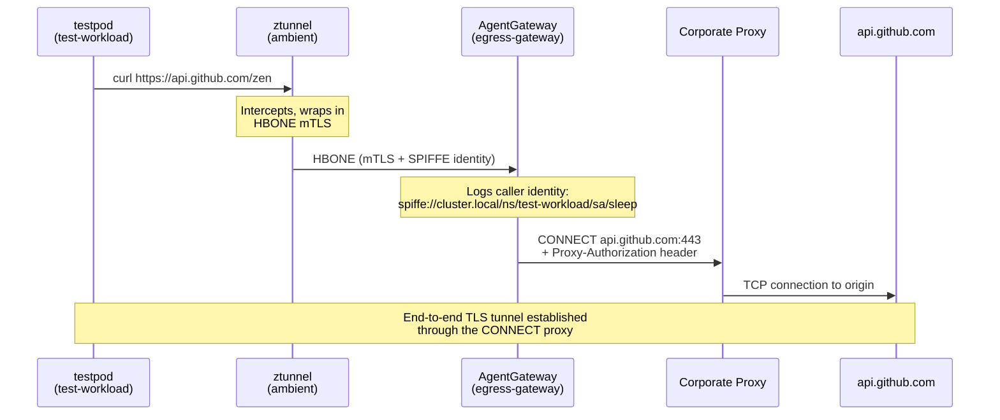
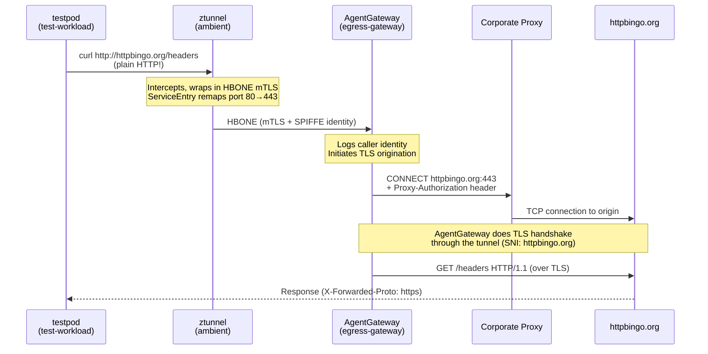
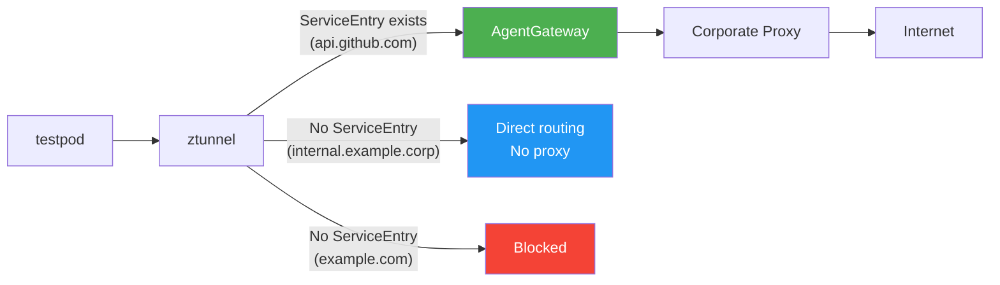
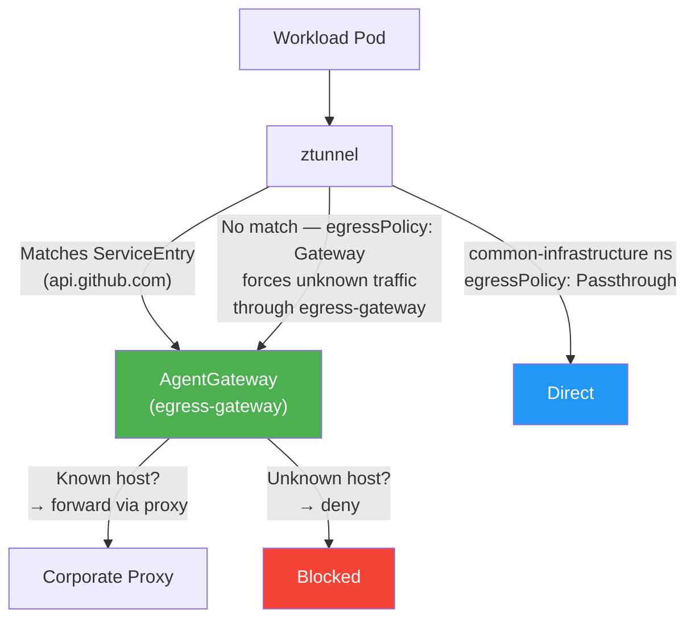
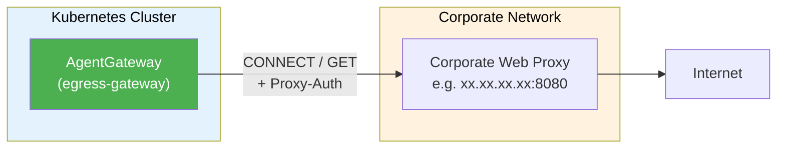
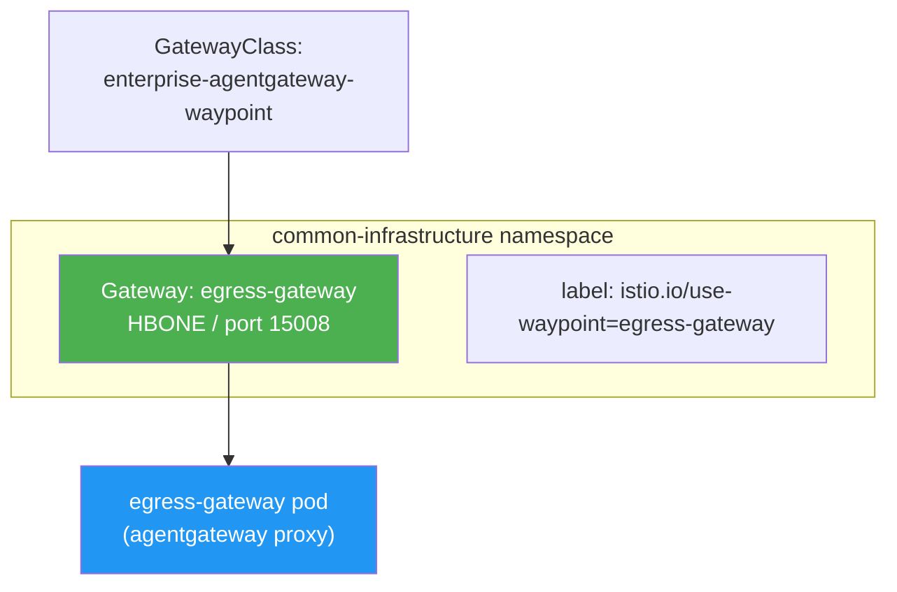
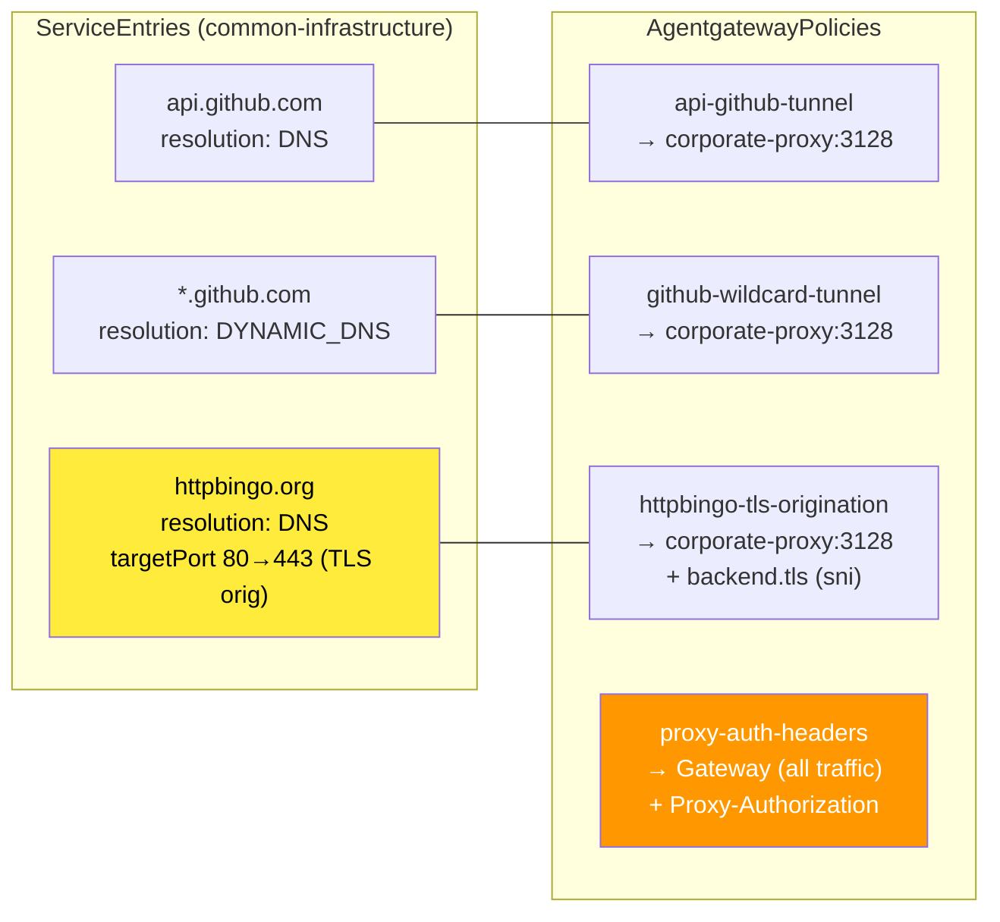
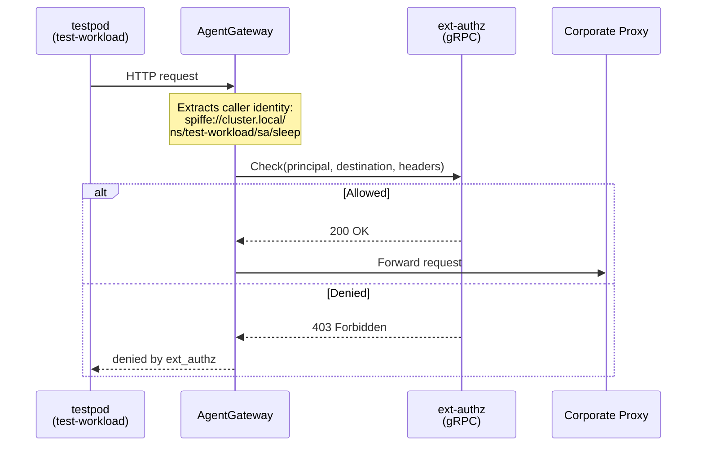
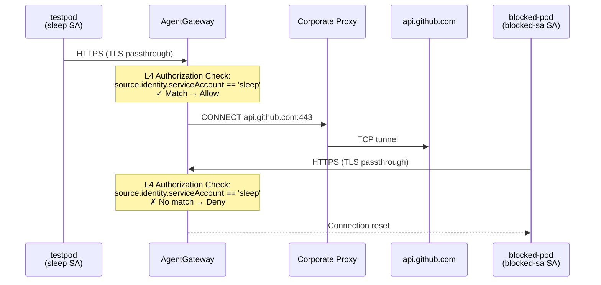

# Egress Gateway with Corporate Proxy: Istio Ambient + AgentGateway

This workshop demonstrates how to route egress traffic through a corporate web proxy using [AgentGateway](https://docs.solo.io/agentgateway/2.1.x/) as an egress waypoint for Istio Ambient mesh.

## Table of Contents

- [The Problem](#the-problem)
- [Architecture](#architecture)
- [Prerequisites](#prerequisites)
- [Install Solo Enterprise Istio](#install-solo-enterprise-istio)
- [Install AgentGateway](#install-agentgateway)
- [Deploy Corporate Web Proxy](#deploy-corporate-web-proxy)
- [Deploy the AgentGateway Egress Gateway](#deploy-the-agentgateway-egress-gateway)
- [Configure External Services](#configure-external-services)
- [Deploy Test Workload](#deploy-test-workload)
- [Test: HTTPS Traffic to api.github.com](#test-https-traffic-to-apigithubcom)
- [Test: HTTPS to *.github.com (Wildcard)](#test-https-to-githubcom-wildcard)
- [Test: TLS Origination (HTTP in, HTTPS out)](#test-tls-origination-http-in-https-out)
- [Test: Proxy Authentication Headers](#test-proxy-authentication-headers)
- [Test: Split-Routing (No-Proxy Logic)](#test-split-routing-no-proxy-logic)
- [External Auth Server (Identity-Aware Authorization)](#external-auth-server-identity-aware-authorization)
- [TCP RBAC (Layer 4 Network Authorization)](#tcp-rbac-layer-4-network-authorization)

## The Problem

Enterprise environments often have three network use cases:

1. **Cluster internal** — traffic stays within the Kubernetes cluster
2. **Corporate internal** — traffic to corporate resources (e.g., `internal.example.corp`) routed directly
3. **External** — traffic to the internet (e.g., `api.github.com`, `gist.github.com`) must flow through the corporate webproxy

For use case 3, the requirements are:
- **Declarative whitelisting**: Only explicitly registered external hosts (via ServiceEntry) are accessible from workload pods
- **Transparent proxying**: Pods perform `curl` without any proxy knowledge — no `HTTP_PROXY` environment variables
- **Automated split-routing**: Corporate-internal traffic routes directly, external traffic tunnels through the webproxy
- **TLS origination**: Workloads send plain HTTP, the gateway upgrades to HTTPS — workloads don't manage certificates
- **Auditability**: Full visibility into which workloads access which external services, with cryptographic identity
- **Proxy authentication**: Ability to inject `Proxy-Authorization` headers to the corporate proxy

### Why Istio Waypoints Alone Don't Work

Istio waypoints are **reverse proxies**. For outbound traffic through a forward proxy, you need:
- HTTP: Absolute URLs (`GET http://api.github.com/path`) — waypoints send relative paths (`GET /path`), causing Squid to return `400 ERR_INVALID_URL`
- HTTPS: Proper `CONNECT host:443` tunnel establishment — waypoints don't construct these correctly

**AgentGateway solves this** by operating as an **explicit forward proxy** within the mesh, producing the correct request patterns for upstream proxies.

## Architecture

### HTTPS Traffic Flow


```mermaid
sequenceDiagram
    participant Pod as testpod<br/>(test-workload)
    participant ZT as ztunnel<br/>(ambient)
    participant AGW as AgentGateway<br/>(egress-gateway)
    participant CP as Corporate Proxy
    participant EXT as api.github.com

    Pod->>ZT: curl https://api.github.com/zen
    Note over ZT: Intercepts, wraps in<br/>HBONE mTLS
    ZT->>AGW: HBONE (mTLS + SPIFFE identity)
    Note over AGW: Logs caller identity:<br/>spiffe://cluster.local/ns/test-workload/sa/sleep
    AGW->>CP: CONNECT api.github.com:443<br/>+ Proxy-Authorization header
    CP->>EXT: TCP connection to origin
    Note over Pod,EXT: End-to-end TLS tunnel established<br/>through the CONNECT proxy
```

### TLS Origination Flow (HTTP in, HTTPS out)


```mermaid
sequenceDiagram
    participant Pod as testpod<br/>(test-workload)
    participant ZT as ztunnel<br/>(ambient)
    participant AGW as AgentGateway<br/>(egress-gateway)
    participant CP as Corporate Proxy
    participant EXT as httpbingo.org

    Pod->>ZT: curl http://httpbingo.org/headers<br/>(plain HTTP!)
    Note over ZT: Intercepts, wraps in HBONE mTLS<br/>ServiceEntry remaps port 80→443
    ZT->>AGW: HBONE (mTLS + SPIFFE identity)
    Note over AGW: Logs caller identity<br/>Initiates TLS origination
    AGW->>CP: CONNECT httpbingo.org:443<br/>+ Proxy-Authorization header
    CP->>EXT: TCP connection to origin
    Note over AGW,EXT: AgentGateway does TLS handshake<br/>through the tunnel (SNI: httpbingo.org)
    AGW->>EXT: GET /headers HTTP/1.1 (over TLS)
    EXT-->>Pod: Response (X-Forwarded-Proto: https)
```

### Split-Routing (No-Proxy Logic)


```mermaid
flowchart LR
    Pod[testpod] --> ZT[ztunnel]

    ZT -->|"ServiceEntry exists<br/>(api.github.com)"| AGW[AgentGateway]
    AGW --> CP[Corporate Proxy] --> Internet

    ZT -->|"No ServiceEntry<br/>(internal.example.corp)"| Direct[Direct routing<br/>No proxy]

    ZT -->|"No ServiceEntry<br/>(example.com)"| Blocked[Blocked]

    style AGW fill:#4CAF50,color:#fff
    style Direct fill:#2196F3,color:#fff
    style Blocked fill:#f44336,color:#fff
```

---

## Prerequisites

- Kubernetes cluster
- Helm 3.x
- Solo Enterprise Istio license key
- AgentGateway license key

## Install Solo Enterprise Istio

```bash
export GLOO_MESH_LICENSE_KEY=<license_key>
export AGENTGATEWAY_LICENSE_KEY=<license_key>

export ISTIO_VERSION=1.29.1-solo
export ISTIO_IMAGE=${ISTIO_VERSION}
export REPO=us-docker.pkg.dev/soloio-img/istio
export HELM_REPO=oci://us-docker.pkg.dev/soloio-img/istio-helm
```

CRDs:
```bash
helm upgrade --install istio-base ${HELM_REPO}/base \
--namespace istio-system \
--create-namespace \
--version ${ISTIO_IMAGE} \
-f - <<EOF
defaultRevision: ""
profile: ambient
EOF
```

Istiod:
```bash
helm upgrade --install istiod ${HELM_REPO}/istiod \
--namespace istio-system \
--version ${ISTIO_IMAGE} \
-f - <<EOF
env:
  PILOT_ENABLE_IP_AUTOALLOCATE: "true"
  PILOT_SKIP_VALIDATE_TRUST_DOMAIN: "true"
global:
  hub: ${REPO}
  network: cluster1
  proxy:
    clusterDomain: cluster.local
  tag: ${ISTIO_IMAGE}
istio_cni:
  namespace: istio-system
  enabled: true
meshConfig:
  accessLogFile: /dev/stdout
  defaultConfig:
    proxyMetadata:
      ISTIO_META_DNS_AUTO_ALLOCATE: "true"
      ISTIO_META_DNS_CAPTURE: "true"
platforms:
  peering:
    enabled: true
profile: ambient
license:
    value: ${GLOO_MESH_LICENSE_KEY}
EOF
```

CNI:
```bash
helm upgrade --install istio-cni ${HELM_REPO}/cni \
--namespace istio-system \
--version ${ISTIO_IMAGE} \
-f - <<EOF
ambient:
  dnsCapture: true
excludeNamespaces:
  - istio-system
  - kube-system
global:
  hub: ${REPO}
  tag: ${ISTIO_IMAGE}
  variant: distroless
  # platform: gke  # Uncomment for GKE
profile: ambient
EOF
```

ztunnel:
```bash
helm upgrade --install ztunnel ${HELM_REPO}/ztunnel \
--namespace istio-system \
--version ${ISTIO_IMAGE} \
-f - <<EOF
configValidation: true
enabled: true
env:
  L7_ENABLED: "true"
  SKIP_VALIDATE_TRUST_DOMAIN: "true"
hub: ${REPO}
tag: ${ISTIO_IMAGE}
istioNamespace: istio-system
namespace: istio-system
network: cluster1
profile: ambient
proxy:
  clusterDomain: cluster.local
terminationGracePeriodSeconds: 29
variant: distroless
egressPolicies:
- namespaces: [common-infrastructure]
  policy: Passthrough
- gateway: egress-gateway.common-infrastructure.svc.cluster.local
  policy: Gateway
  matchCidrs:
  - 0.0.0.0/0
  - ::/0
EOF
```

### ztunnel Egress Policies

The `egressPolicies` configuration above is a feature of Solo Enterprise for Istio. It instructs ztunnel how to handle outbound traffic that doesn't match a known service. Waypoint routing works without these policies, but unregistered hosts will bypass the gateway:


```mermaid
flowchart TB
    pod["Workload Pod"] --> zt["ztunnel"]

    zt -->|"Matches ServiceEntry<br/>(api.github.com)"| agw["AgentGateway<br/>(egress-gateway)"]
    zt -->|"No match — egressPolicy: Gateway<br/>forces unknown traffic<br/>through egress-gateway"| agw
    zt -->|"common-infrastructure ns<br/>egressPolicy: Passthrough"| direct["Direct"]

    agw -->|"Known host?<br/>→ forward via proxy"| proxy["Corporate Proxy"]
    agw -->|"Unknown host?<br/>→ deny"| blocked["Blocked"]

    style agw fill:#4CAF50,color:#fff
    style blocked fill:#f44336,color:#fff
    style direct fill:#2196F3,color:#fff
```

Three policy modes:
- **Passthrough** — traffic forwarded as-is (used for `common-infrastructure` namespace itself)
- **Gateway** — traffic forced to the egress gateway (used for all other traffic via `0.0.0.0/0`)
- **Deny** — traffic blocked outright (can be used for specific CIDRs)

With this configuration, a pod **cannot** bypass the egress gateway by curling a host that has no ServiceEntry — ztunnel forces all outbound traffic through the AgentGateway, where it can be inspected, logged, and denied.

> **Note:** ztunnel egress policies are **optional** for waypoint routing — the `use-waypoint` label on ServiceEntries is sufficient. Egress policies add a defense-in-depth layer by forcing unregistered traffic through the gateway. They should be used alongside Kubernetes NetworkPolicies for comprehensive enforcement.

---

## Install AgentGateway

```bash
export AGENTGATEWAY_LICENSE_KEY=<license_key>

kubectl apply --server-side -f https://github.com/kubernetes-sigs/gateway-api/releases/download/v1.4.0/experimental-install.yaml

helm upgrade -i enterprise-agentgateway-crds oci://us-central1-docker.pkg.dev/developers-369321/enterprise-agentgateway-public-nonprod/charts/enterprise-agentgateway-crds \
  --create-namespace --namespace agentgateway-system \
  --version v2.4.0-alpha.c19050defdff54637eccec960131e7049c2f1be9

helm upgrade -i enterprise-agentgateway oci://us-central1-docker.pkg.dev/developers-369321/enterprise-agentgateway-public-nonprod/charts/enterprise-agentgateway \
  --namespace agentgateway-system \
  --set-string licensing.licenseKey=${AGENTGATEWAY_LICENSE_KEY} \
  --version v2.4.0-alpha.c19050defdff54637eccec960131e7049c2f1be9
```

---

## Deploy Corporate Web Proxy

In production, the corporate web proxy lives **outside the Kubernetes cluster** — it's a separate appliance on the corporate network (e.g., a Fortigate-managed proxy). The mesh only needs to know the proxy's IP and port; any further chaining (e.g., to an upstream government proxy) is handled by the corporate proxy itself, not by the mesh.


```mermaid
flowchart LR
    subgraph cluster["Kubernetes Cluster"]
        AGW["AgentGateway<br/>(egress-gateway)"]
    end

    subgraph corpnet["Corporate Network"]
        CP["Corporate Web Proxy<br/>e.g. xx.xx.xx.xx:8080"]
    end

    AGW -->|"CONNECT / GET<br/>+ Proxy-Auth"| CP
    CP --> Internet["Internet"]

    style cluster fill:#e3f2fd,color:#000
    style corpnet fill:#fff3e0,color:#000
    style AGW fill:#4CAF50,color:#fff
```

For this workshop, we simulate the corporate proxy in-cluster with a Squid deployment:

```yaml
apiVersion: v1
kind: Namespace
metadata:
  name: corporate-proxy
---
apiVersion: v1
kind: ConfigMap
metadata:
  name: corporate-proxy-config
  namespace: corporate-proxy
data:
  snippet.conf: |
    http_port 3128
    acl SSL_ports port 443
    acl Safe_ports port 80
    acl Safe_ports port 443
    http_access allow CONNECT SSL_ports
    http_access allow Safe_ports
    http_access deny all
---
apiVersion: apps/v1
kind: Deployment
metadata:
  name: corporate-proxy
  namespace: corporate-proxy
  labels:
    app: corporate-proxy
spec:
  replicas: 1
  selector:
    matchLabels:
      app: corporate-proxy
  template:
    metadata:
      labels:
        app: corporate-proxy
    spec:
      containers:
      - name: squid
        image: ubuntu/squid:latest
        ports:
        - containerPort: 3128
          name: proxy
          protocol: TCP
        volumeMounts:
        - name: squid-config
          mountPath: /etc/squid/conf.d/snippet.conf
          subPath: snippet.conf
      volumes:
      - name: squid-config
        configMap:
          name: corporate-proxy-config
---
apiVersion: v1
kind: Service
metadata:
  name: corporate-proxy
  namespace: corporate-proxy
spec:
  type: ClusterIP
  ports:
  - port: 3128
    targetPort: 3128
    protocol: TCP
    name: proxy
  selector:
    app: corporate-proxy
```

In production, skip this step and point the EnterpriseAgentgatewayPolicy tunnel `backendRef` directly at your corporate proxy's address and port.

**Important Squid Configuration:** The proxy must allow `CONNECT` on port 443 for HTTPS tunneling and accept traffic on safe ports (80, 443). Without `http_access allow CONNECT SSL_ports`, HTTPS requests will fail.

---

## Deploy the AgentGateway Egress Gateway


```mermaid
flowchart TB
    subgraph common-infrastructure["common-infrastructure namespace"]
        gw["Gateway: egress-gateway<br/>HBONE / port 15008"]
        label["label: istio.io/use-waypoint=egress-gateway"]
    end

    gc["GatewayClass:<br/>enterprise-agentgateway-waypoint"] --> gw
    gw --> pod["egress-gateway pod<br/>(agentgateway proxy)"]

    style gw fill:#4CAF50,color:#fff
    style pod fill:#2196F3,color:#fff
```

### Create the egress gateway namespace

```bash
kubectl create ns common-infrastructure
kubectl label ns common-infrastructure istio.io/use-waypoint=egress-gateway
```

### Deploy the egress gateway

```yaml
---
apiVersion: enterpriseagentgateway.solo.io/v1alpha1
kind: EnterpriseAgentgatewayParameters
metadata:
  name: agentgateway
  namespace: agentgateway-system
spec:
  rawConfig:
    config:
      logging:
        fields:
          add:
            caller: source
---
apiVersion: gateway.networking.k8s.io/v1
kind: GatewayClass
metadata:
  annotations:
    ambient.istio.io/waypoint-inbound-binding: PROXY/15088
  name: enterprise-agentgateway-waypoint
spec:
  controllerName: solo.io/enterprise-agentgateway
  description: Class for Istio ambient mesh waypoint with agentgateway.
  parametersRef:
    kind: EnterpriseAgentgatewayParameters
    group: enterpriseagentgateway.solo.io
    name: agentgateway
    namespace: agentgateway-system
---
apiVersion: gateway.networking.k8s.io/v1
kind: Gateway
metadata:
  name: egress-gateway
  namespace: common-infrastructure
spec:
  gatewayClassName: enterprise-agentgateway-waypoint
  listeners:
  - name: mesh
    port: 15008
    protocol: HBONE
```

---

## Configure External Services


```mermaid
flowchart LR
    subgraph ServiceEntries["ServiceEntries (common-infrastructure)"]
        se1["api.github.com<br/>resolution: DNS"]
        se2["*.github.com<br/>resolution: DYNAMIC_DNS"]
        se3["httpbingo.org<br/>resolution: DNS<br/>targetPort 80→443 (TLS orig)"]
    end

    subgraph Policies["AgentgatewayPolicies"]
        p1["api-github-tunnel<br/>→ corporate-proxy:3128"]
        p2["github-wildcard-tunnel<br/>→ corporate-proxy:3128"]
        p3["httpbingo-tls-origination<br/>→ corporate-proxy:3128<br/>+ backend.tls (sni)"]
        p4["proxy-auth-headers<br/>→ Gateway (all traffic)<br/>+ Proxy-Authorization"]
    end

    se1 --- p1
    se2 --- p2
    se3 --- p3

    style se3 fill:#ffeb3b,color:#000
    style p4 fill:#ff9800,color:#fff
```

### ServiceEntry for api.github.com

```yaml
apiVersion: networking.istio.io/v1beta1
kind: ServiceEntry
metadata:
  name: api-github-com
  namespace: common-infrastructure
  labels:
    istio.io/use-waypoint: egress-gateway
spec:
  hosts:
  - api.github.com
  location: MESH_EXTERNAL
  resolution: DNS
  ports:
  - number: 80
    name: http
    protocol: HTTP
  - number: 443
    name: https
    protocol: TLS
---
apiVersion: enterpriseagentgateway.solo.io/v1alpha1
kind: EnterpriseAgentgatewayPolicy
metadata:
  name: api-github-tunnel
  namespace: common-infrastructure
spec:
  targetRefs:
    - name: api-github-com
      kind: ServiceEntry
      group: networking.istio.io
  backend:
    tunnel:
      backendRef:
        name: corporate-proxy
        kind: Service
        namespace: corporate-proxy
        port: 3128
```

### ServiceEntry for *.github.com (wildcard)

```yaml
apiVersion: networking.istio.io/v1beta1
kind: ServiceEntry
metadata:
  name: github-wildcard
  namespace: common-infrastructure
  labels:
    istio.io/use-waypoint: egress-gateway
spec:
  hosts:
  - "*.github.com"
  location: MESH_EXTERNAL
  resolution: DYNAMIC_DNS
  ports:
  - number: 80
    name: http
    protocol: HTTP
  - number: 443
    name: https
    protocol: TLS
---
apiVersion: enterpriseagentgateway.solo.io/v1alpha1
kind: EnterpriseAgentgatewayPolicy
metadata:
  name: github-wildcard-tunnel
  namespace: common-infrastructure
spec:
  targetRefs:
    - name: github-wildcard
      kind: ServiceEntry
      group: networking.istio.io
  backend:
    tunnel:
      backendRef:
        name: corporate-proxy
        kind: Service
        namespace: corporate-proxy
        port: 3128
```

### ServiceEntry for httpbingo.org (TLS origination)

This ServiceEntry demonstrates **TLS origination**: the workload sends plain HTTP, and the egress gateway upgrades to HTTPS before forwarding through the proxy. The `targetPort: 443` on the HTTP port tells Istio to remap port 80 → 443 before traffic reaches AgentGateway:

```yaml
apiVersion: networking.istio.io/v1
kind: ServiceEntry
metadata:
  name: httpbingo-tls-origination
  namespace: common-infrastructure
  labels:
    istio.io/use-waypoint: egress-gateway
spec:
  hosts:
  - httpbingo.org
  location: MESH_EXTERNAL
  resolution: DNS
  ports:
  - number: 80
    name: http
    protocol: HTTP
    targetPort: 443
  - number: 443
    name: https
    protocol: TLS
---
apiVersion: enterpriseagentgateway.solo.io/v1alpha1
kind: EnterpriseAgentgatewayPolicy
metadata:
  name: httpbingo-tls-origination-tunnel
  namespace: common-infrastructure
spec:
  targetRefs:
    - name: httpbingo-tls-origination
      kind: ServiceEntry
      group: networking.istio.io
  backend:
    tunnel:
      backendRef:
        name: corporate-proxy
        kind: Service
        namespace: corporate-proxy
        port: 3128
    tls:
      sni: httpbingo.org
```

### Proxy Authentication Headers

Inject `Proxy-Authorization` header on all egress traffic for the corporate proxy. Workloads don't need to know about proxy credentials:

```yaml
apiVersion: enterpriseagentgateway.solo.io/v1alpha1
kind: EnterpriseAgentgatewayPolicy
metadata:
  name: proxy-auth-headers
  namespace: common-infrastructure
spec:
  targetRefs:
    - group: gateway.networking.k8s.io
      kind: Gateway
      name: egress-gateway
  traffic:
    headerModifiers:
      request:
        add:
        - name: Proxy-Authorization
          value: "Basic Y2ppYi11c2VyOmNqaWItcGFzc3dvcmQ="
```

**How split-routing works:** Only hosts with a matching ServiceEntry labeled `istio.io/use-waypoint: egress-gateway` are routed through the egress gateway and proxy. Traffic to corporate-internal hosts has no ServiceEntry, so it routes directly — no proxy, no detour.

---

## Deploy Test Workload

```bash
kubectl create ns test-workload
kubectl label ns test-workload istio.io/dataplane-mode=ambient
kubectl apply -f https://raw.githubusercontent.com/istio/istio/refs/heads/master/samples/sleep/sleep.yaml -n test-workload
```

---

## Test: HTTPS Traffic to api.github.com

The workload pod curls `api.github.com` with no proxy awareness — just a normal HTTPS request:

```bash
kubectl exec deploy/sleep -n test-workload -- curl -s https://api.github.com/zen
```

Expected output:
```
Mind your words, they are important.
```

### Check the Logs

**AgentGateway logs** — shows caller SPIFFE identity:
```bash
kubectl logs deploy/egress-gateway -n common-infrastructure --tail=5
```

```
info  request gateway=common-infrastructure/egress-gateway endpoint=api.github.com:443
  tls.sni=api.github.com protocol=tcp duration=129ms
  caller={"identity": {"namespace": "test-workload", "serviceAccount": "sleep"},
    "subjectAltNames": ["spiffe://cluster.local/ns/test-workload/sa/sleep"]}
```

**Corporate proxy logs** — shows CONNECT tunnel to origin:
```bash
kubectl logs deploy/corporate-proxy -n corporate-proxy --tail=5
```

```
TCP_TUNNEL/200 4329 CONNECT api.github.com:443 - HIER_DIRECT/140.82.114.6 -
```

---

## Test: HTTPS to *.github.com (Wildcard)

```bash
kubectl exec deploy/sleep -n test-workload -- curl -s -o /dev/null -w "%{http_code}" https://gist.github.com
```

Expected output:
```
200
```

Check the proxy logs:
```bash
kubectl logs deploy/corporate-proxy -n corporate-proxy --tail=3
```

```
TCP_TUNNEL/200 35691 CONNECT gist.github.com:443 - HIER_DIRECT/... -
```

The wildcard ServiceEntry for `*.github.com` means any subdomain is automatically routed through the egress gateway — no per-subdomain configuration needed.

---

## Test: TLS Origination (HTTP in, HTTPS out)

This is the key demo for TLS origination. The workload sends **plain HTTP** — no TLS, no certificates — and the egress gateway upgrades to HTTPS before forwarding through the proxy:

```bash
kubectl exec deploy/sleep -n test-workload -- curl -s http://httpbingo.org/headers
```

Expected output:
```json
{
  "headers": {
    "Host": ["httpbingo.org"],
    "X-Forwarded-Port": ["443"],
    "X-Forwarded-Proto": ["https"],
    "X-Forwarded-Ssl": ["on"]
  }
}
```

**The proof:** `X-Forwarded-Proto: https` and `X-Forwarded-Ssl: on` — the external service received HTTPS even though the workload sent plain HTTP. The workload didn't configure any TLS certificates.

Check the proxy logs — shows `CONNECT :443` (not `GET :80`):
```bash
kubectl logs deploy/corporate-proxy -n corporate-proxy --tail=3
```

```
TCP_TUNNEL/200 ... CONNECT 66.241.125.232:443 - HIER_DIRECT/... -
```

### How TLS Origination Works


```mermaid
flowchart LR
    Pod["testpod<br/>curl http://httpbingo.org"] -->|"plain HTTP<br/>port 80"| ZT["ztunnel"]
    ZT -->|"HBONE mTLS<br/>port remapped 80→443<br/>(ServiceEntry targetPort)"| AGW["AgentGateway"]
    AGW -->|"CONNECT :443<br/>+ TLS origination<br/>(backend.tls + sni)"| CP["Corporate Proxy"]
    CP -->|"HTTPS"| EXT["httpbingo.org:443"]

    style Pod fill:#ffeb3b,color:#000
    style AGW fill:#4CAF50,color:#fff
    style EXT fill:#2196F3,color:#fff
```

The configuration combines:
1. **ServiceEntry** with `targetPort: 443` on the HTTP port — Istio remaps port 80→443 before traffic reaches AgentGateway
2. **EnterpriseAgentgatewayPolicy** with `backend.tls.sni: httpbingo.org` — AgentGateway originates TLS through the CONNECT tunnel

---

## Test: Proxy Authentication Headers

The `proxy-auth-headers.yml` policy injects `Proxy-Authorization: Basic ...` on all HTTP requests flowing through the egress gateway. This authenticates with the corporate proxy — workloads don't need to know about proxy credentials.

To verify header injection works, check the httpbingo response headers (via the TLS origination test):

```bash
kubectl exec deploy/sleep -n test-workload -- curl -s http://httpbingo.org/headers
```

In the output you'll see `Proxy-Authorization` in the headers — with TLS origination, the header is sent over the encrypted connection and is visible at the destination. In a real environment, the proxy would consume this header for authentication (standard hop-by-hop behavior).

Replace the Base64 value in `proxy-auth-headers.yml` with your actual proxy credentials.

---

## Test: Split-Routing (No-Proxy Logic)

Traffic to hosts **without** a ServiceEntry routes directly — it never hits the egress gateway or proxy. This is how corporate-internal traffic bypasses the proxy automatically.

```bash
kubectl exec deploy/sleep -n test-workload -- curl -s --max-time 5 -o /dev/null -w "%{http_code}" https://example.com
```

This will timeout or fail because `example.com` has no ServiceEntry — the mesh doesn't know how to route it. This is **explicit whitelisting** in action: only declared external services are reachable.

Without egress policies, traffic to unregistered hosts bypasses the gateway. With egress policies, unregistered traffic is forced through the gateway as a defense-in-depth measure. Use alongside Kubernetes NetworkPolicies for comprehensive enforcement.

---

## External Auth Server (Identity-Aware Authorization)


```mermaid
sequenceDiagram
    participant Pod as testpod<br/>(test-workload)
    participant AGW as AgentGateway
    participant Auth as ext-authz<br/>(gRPC)
    participant Proxy as Corporate Proxy

    Pod->>AGW: HTTP request
    Note over AGW: Extracts caller identity:<br/>spiffe://cluster.local/<br/>ns/test-workload/sa/sleep
    AGW->>Auth: Check(principal, destination, headers)
    alt Allowed
        Auth-->>AGW: 200 OK
        AGW->>Proxy: Forward request
    else Denied
        Auth-->>AGW: 403 Forbidden
        AGW-->>Pod: denied by ext_authz
    end
```

> Note: ext-auth currently works for HTTP traffic. HTTPS support is coming.

Deploy the external authorization server:

```yaml
apiVersion: enterpriseagentgateway.solo.io/v1alpha1
kind: EnterpriseAgentgatewayPolicy
metadata:
  namespace: common-infrastructure
  name: gateway-ext-auth-policy
spec:
  targetRefs:
    - group: gateway.networking.k8s.io
      kind: Gateway
      name: egress-gateway
  traffic:
    extAuth:
      backendRef:
        name: ext-authz
        namespace: common-infrastructure
        port: 9000
      grpc: {}
---
apiVersion: v1
kind: Service
metadata:
  namespace: common-infrastructure
  name: ext-authz
  labels:
    app: ext-authz
spec:
  ports:
  - port: 9000
    targetPort: 9000
    protocol: TCP
    appProtocol: kubernetes.io/h2c
  selector:
    app: ext-authz
---
apiVersion: apps/v1
kind: Deployment
metadata:
  namespace: common-infrastructure
  name: ext-authz
spec:
  replicas: 1
  selector:
    matchLabels:
      app: ext-authz
  template:
    metadata:
      labels:
        app: ext-authz
        app.kubernetes.io/name: ext-authz
    spec:
      containers:
      - image: gcr.io/istio-testing/ext-authz:1.25-dev
        name: ext-authz
        ports:
        - containerPort: 9000
```

This enables authorization decisions based on the **SPIFFE identity** of the calling workload.

### Test: HTTP without authorization header

```bash
kubectl exec deploy/sleep -n test-workload -- curl -s http://httpbingo.org/headers
```

Expected output:
```
denied by ext_authz for not found header `x-ext-authz: allow` in the request
```

### Test: HTTP with authorization header

```bash
kubectl exec deploy/sleep -n test-workload -- curl -s http://httpbingo.org/headers -H "x-ext-authz: allow"
```

Expected output includes:
```json
{
  "headers": {
    "X-Ext-Authz-Check-Received": [
      "source:{principal:\"spiffe://cluster.local/ns/test-workload/sa/sleep\"} ..."
    ],
    "X-Ext-Authz-Check-Result": [
      "allowed"
    ]
  }
}
```

The ext-auth server receives the **SPIFFE identity** of the caller (`spiffe://cluster.local/ns/test-workload/sa/sleep`), enabling dynamic per-workload authorization decisions. In production, replace this sample server with your own policy engine.

---

## TCP RBAC (Layer 4 Network Authorization)

AgentGateway supports two levels of authorization:

| | HTTP Authorization (`traffic.authorization`) | Network Authorization (`frontend.networkAuthorization`) |
|---|---|---|
| **Layer** | L7 — runs after HTTP parsing | L4 — runs before protocol handling |
| **Works on** | HTTP/gRPC traffic (e.g., TLS origination) | All traffic including HTTPS passthrough (opaque TLS) |
| **Can inspect** | HTTP headers, method, path, host | Source IP, port, SPIFFE identity |
| **Use when** | You need request-level decisions | Traffic is encrypted end-to-end (TLS passthrough) |

For **HTTPS passthrough** traffic (e.g., `curl https://api.github.com`), the gateway never decrypts the TLS — it's an opaque TCP tunnel. HTTP-level ext-auth and `traffic.authorization` can't see inside it. `networkAuthorization` is the only way to enforce identity-based access control on this traffic.


```mermaid
sequenceDiagram
    participant Pod as testpod<br/>(sleep SA)
    participant AGW as AgentGateway
    participant Proxy as Corporate Proxy
    participant EXT as api.github.com

    Pod->>AGW: HTTPS (TLS passthrough)
    Note over AGW: L4 Authorization Check:<br/>source.identity.serviceAccount == 'sleep'<br/>✓ Match → Allow
    AGW->>Proxy: CONNECT api.github.com:443
    Proxy->>EXT: TCP tunnel

    participant Pod2 as blocked-pod<br/>(blocked-sa SA)
    Pod2->>AGW: HTTPS (TLS passthrough)
    Note over AGW: L4 Authorization Check:<br/>source.identity.serviceAccount == 'sleep'<br/>✗ No match → Deny
    AGW-->>Pod2: Connection reset
```

Deploy an allowlist policy scoped to the `api-github-com` ServiceEntry — only the `sleep` service account can reach GitHub:

```yaml
apiVersion: enterpriseagentgateway.solo.io/v1alpha1
kind: EnterpriseAgentgatewayPolicy
metadata:
  name: tcp-rbac-github-only
  namespace: common-infrastructure
spec:
  targetRefs:
    - name: api-github-com
      kind: ServiceEntry
      group: networking.istio.io
  frontend:
    networkAuthorization:
      action: Allow
      policy:
        matchExpressions:
          - "source.identity.serviceAccount == 'sleep'"
```

By targeting the ServiceEntry instead of the Gateway, the policy only affects traffic to `api.github.com` — other services like `httpbingo.org` remain accessible to all workloads.

> **Important:** The TLS identity fields are flattened into the `source` context. Use `source.identity.serviceAccount`, `source.identity.namespace`, and `source.identity.trustDomain` — not `source.tls.identity.*`.

### Available CEL variables for network authorization

| Variable | Type | Description |
|----------|------|-------------|
| `source.address` | IP | Client IP address |
| `source.port` | int | Client TCP port |
| `source.identity.serviceAccount` | string | Workload service account |
| `source.identity.namespace` | string | Workload namespace |
| `source.identity.trustDomain` | string | SPIFFE trust domain |

### Test: Allowed service account (sleep → GitHub)

```bash
kubectl exec deploy/sleep -n test-workload -- curl -s https://api.github.com/zen
```

Expected output:
```
Mind your words, they are important.
```

### Test: Blocked service account (blocked-sa → GitHub)

```bash
kubectl create serviceaccount blocked-sa -n test-workload
kubectl run blocked-test --image=curlimages/curl:latest -n test-workload \
  --overrides='{"spec":{"serviceAccountName":"blocked-sa"}}' \
  --labels="istio.io/dataplane-mode=ambient" \
  --restart=Never -- sleep 3600

kubectl exec blocked-test -n test-workload -- curl -s --max-time 5 https://api.github.com/zen
```

Expected: connection reset (exit code 35). Check the gateway logs:
```bash
kubectl logs deploy/egress-gateway -n common-infrastructure --tail=3
```

```
request src.addr=... error="authorization failed" caller={... "serviceAccount": "blocked-sa" ...}
```

### Test: Blocked SA can still reach other services

Because the policy targets only `api-github-com`, the blocked SA can still reach httpbingo:

```bash
kubectl exec blocked-test -n test-workload -- curl -s http://httpbingo.org/get | head -5
```

Expected: 200 OK with JSON response — the policy doesn't affect httpbingo traffic.

### Authorization policy modes

| Action | Behavior |
|--------|----------|
| `Allow` | Allowlist — at least one rule must match, everything else is denied |
| `Deny` | Denylist — matching connections are rejected, everything else is allowed |
| `Require` | All require rules must match (conjunctive across merged policies) |

Example: deny a specific namespace while allowing everything else:

```yaml
frontend:
  networkAuthorization:
    action: Deny
    policy:
      matchExpressions:
        - "source.identity.namespace == 'untrusted-ns'"
```

Example: allow only traffic from the 10.x.x.x CIDR:

```yaml
frontend:
  networkAuthorization:
    action: Allow
    policy:
      matchExpressions:
        - "cidr('10.0.0.0/8').containsIP(source.address)"
```

Clean up:
```bash
kubectl delete pod blocked-test -n test-workload
kubectl delete sa blocked-sa -n test-workload
kubectl delete enterpriseagentgatewaypolicy tcp-rbac-github-only -n common-infrastructure
```

